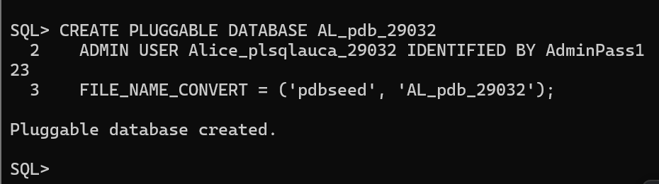
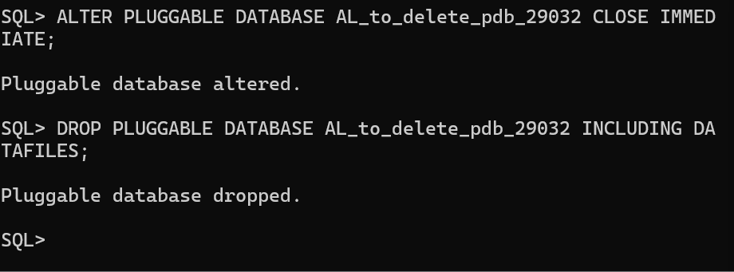
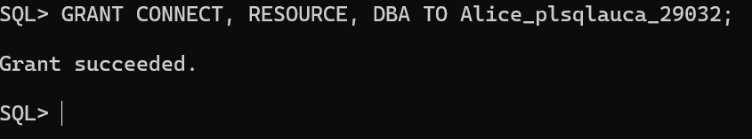
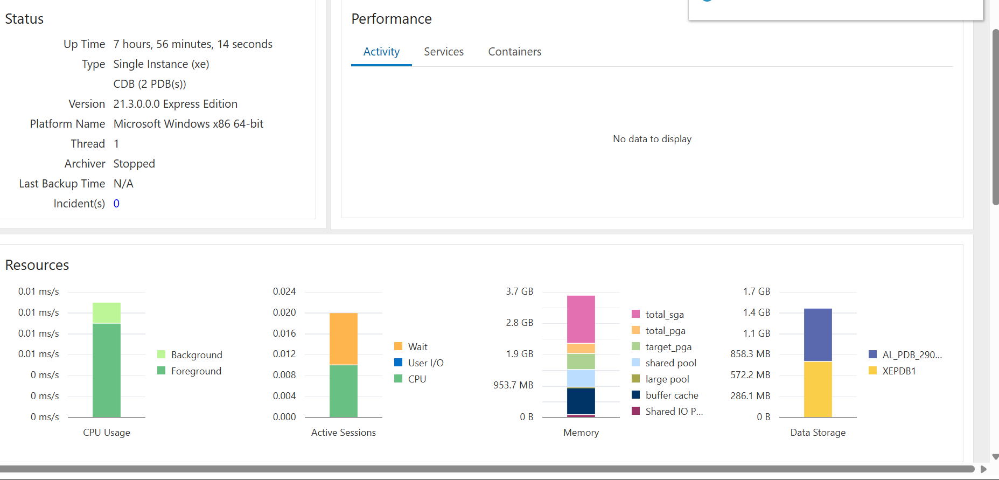

# Oracle PDB Management Assignment

## Student Information

| Item | Details |
|---|---|
| **Name** | UMUTONI HIGIRO ALICE |
| **Student ID** | 29032 |
| **PDB Name** | `AL_pdb_29032` |
| **PDB User** | `AL_plsqlauca_29032` |

---

## 1. Overview

This repository contains my individual work for the Oracle Pluggable Database Assignment II.

The assignment covers:

1. Creating a new Pluggable Database (PDB)
   
3. Creating and deleting a temporary PDB
   
5. Setting up and accessing Oracle Enterprise Manager (OEM)
   
7. Documenting the completed work and providing screenshot evidence
   

All tasks were performed individually in my Oracle environment, and the screenshots included in this repository provide evidence of the completed activities.

---

## 2. Oracle Environment

The assignment was completed using an Oracle Database environment with Pluggable Database (PDB) functionality and Oracle Enterprise Manager.

### Main PDB

- **PDB Name:** `AL_pdb_29032`
- **PDB User:** `AL_plsqlauca_29032`
- **Student:** ALICE
- **Student ID:** 29032

The PDB user was created inside the assigned PDB and is intended for future class work.

---

# Task 1: Create a New Pluggable Database

## Objective

The objective of Task 1 was to create a new Pluggable Database using the required naming convention and create a user inside the PDB.

### PDB Created

The required PDB was created with the following name:

```text
AL_pdb_29032
